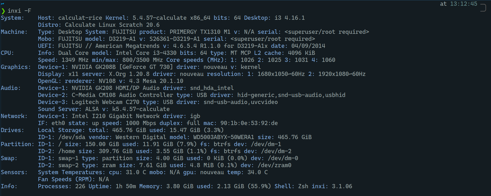

# Ma configuration de bureau.
Voici une liste à-peu-près complète de ce que j'utilise au quotidien

[[toc]]

### Pc fixe

## Matériel
Au niveau de la configuration matérielle, j'ai un `Fujistu Primergy TX1310 M1` avec un Intel core I3 4330, 4GO de RAM et une [NVIDIA Geforce GT730](https://youtu.be/iYWzMvlj2RQ) (pilote nouveau)

## Logiciel
### Système d'exploitation
Mon système d'exploitation principal est Calculate Linux, que j'adore sur pas mal de points, voici quelques exemples:
- Flexibilité du système (moins que chez Gentoo)
- OpenRc (je **déteste** systemd) 
- Légère, je boot en 14secondes et ma config prend 240mo

### Pc portable
::: danger
Indisponible actuellement: Pc en répartion
:::