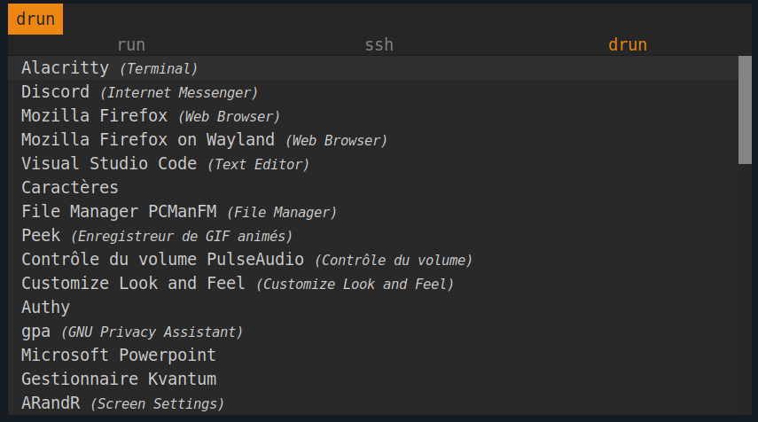
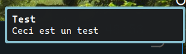
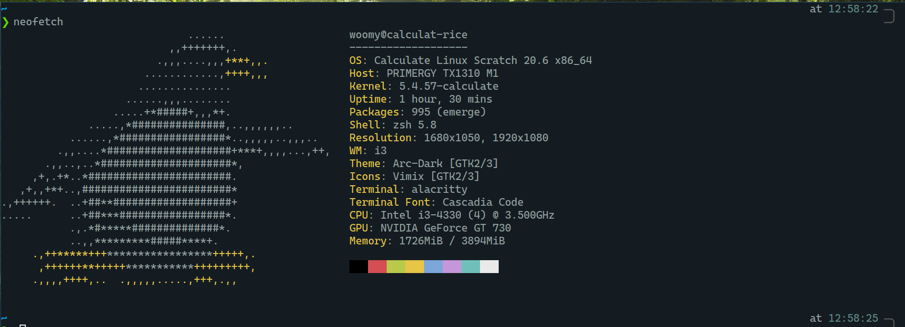
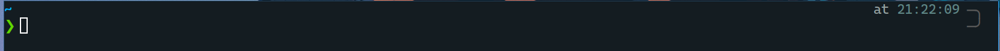
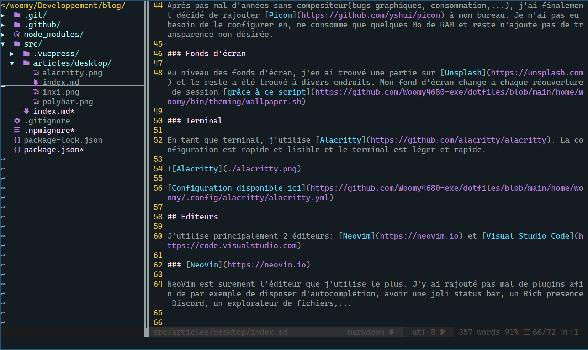
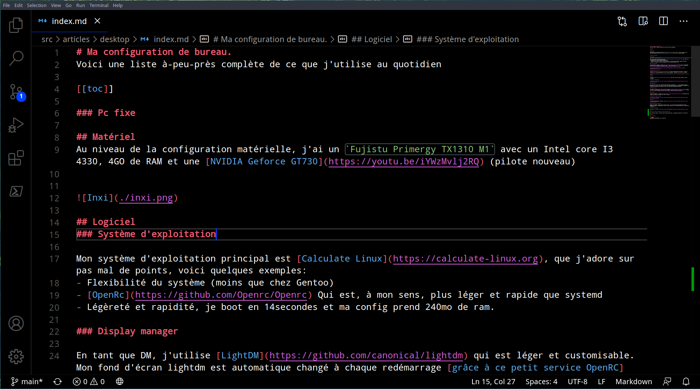

# Ma configuration de bureau.
Voici une liste à-peu-près complète de ce que j'utilise au quotidien

[[toc]]

### Pc fixe

## Matériel
Au niveau de la configuration matérielle, j'ai un `Fujistu Primergy TX1310 M1` avec un Intel core I3 4330, 4GO de RAM et une [NVIDIA Geforce GT730](https://youtu.be/iYWzMvlj2RQ) (pilote nouveau)

## Logiciel
### Système d'exploitation

Mon système d'exploitation principal est [Calculate Linux](https://calculate-linux.org), que j'adore sur pas mal de points, voici quelques exemples:
- Flexibilité du système (moins que chez Gentoo)
- [OpenRc](https://github.com/Openrc/Openrc) Qui est, à mon sens, plus léger et rapide que systemd
- Légèreté et rapidité, je boot en 14secondes et ma config prend 240mo de ram.

### Display manager

En tant que DM, j'utilise [LightDM](https://github.com/canonical/lightdm) qui est léger et customisable. Mon fond d'écran lightdm est automatique changé à chaque redémarrage [grâce à ce petit service OpenRC](https://github.com/Woomy4680-exe/dotfiles/blob/main/etc/init.d/lightdm-wallpaper).

[Configuration disponible ici](https://github.com/Woomy4680-exe/dotfiles/blob/main/etc/lightdm/lightdm-gtk-greeter.conf.clt)

### Gestionnaire de fenêtres

J'utilise [I3-Gaps](https://github.com/AirBlader/I3) en tant que gestionnaire de fênetres, j'adore le tiling et il a l'énorme avantage d'être très léger et possible à controler **totalement** au clavier

[Configuration disponible ici](https://github.com/Woomy4680-exe/dotfiles/blob/main/home/woomy/.config/i3/config)

### Barre

J'utilise [PolyBar](https://github.com/polybar/polybar) pour avoir une barre status simple et facile à configurer. 

[Configuration Disponible ici](https://github.com/Woomy4680-exe/dotfiles/blob/main/home/woomy/.config/polybar/config.ini)

### Compositeur

Après pas mal d'années sans compositeur(bugs graphiques, consommation,...), j'ai finalement décidé de rajouter [Picom](https://github.com/yshui/picom) à mon bureau. Je n'ai pas eu besoin de le configurer en, ne consomme que quelques Mo de RAM et reste n'ajoute pas de transparence non désirée.

### Lanceur d'applications

J'utilise [rofi](https://github.com/davatorium/rofi) en tant que lanceur d'applications, il est léger un facilement customisable. 

[Configuration disponible ici](https://github.com/Woomy4680-exe/dotfiles/tree/main/home/woomy/.config/rofi)

### Notifications

C'est [dunst](https://dunst-project.org/) qui gère mes notfications.

[Configuration disponible ici](https://github.com/Woomy4680-exe/dotfiles/blob/main/home/woomy/.config/dunst/dunstrc)

### Fonds d'écran

Au niveau des fonds d'écran, j'en ai trouvé une partie sur [Unsplash](https://unsplash.com) et le reste a été trouvé à divers endroits. Mon fond d'écran change à chaque réouverture de session [grâce à ce script](https://github.com/Woomy4680-exe/dotfiles/blob/main/home/woomy/bin/theming/wallpaper.sh)

### Terminal

En tant que terminal, j'utilise [Alacritty](https://github.com/alacritty/alacritty). La configuration est rapide et lisible et le terminal est léger et rapide.

[Configuration disponible ici](https://github.com/Woomy4680-exe/dotfiles/blob/main/home/woomy/.config/alacritty/alacritty.yml)

### Shell

J'utilise [ZSH](https://www.zsh.org/) en tant que shell avec [Powerlevel10K](https://github.com/romkatv/powerlevel10k) et [Oh-My-zsh](https://ohmyz.sh/) 

 

[Configuration de ZSH](https://github.com/Woomy4680-exe/dotfiles/blob/main/home/woomy/.zshrc)

[Configuration de Powerlevel10K](https://github.com/Woomy4680-exe/dotfiles/blob/main/home/woomy/.p10k.zsh)

## Editeurs

J'utilise principalement 2 éditeurs: [Neovim](https://neovim.io) et [Visual Studio Code](https://code.visualstudio.com)

### [NeoVim](https://neovim.io)

NeoVim est surement l'éditeur que j'utilise le plus. J'y ai rajouté pas mal de plugins afin de par exemple de disposer d'autocomplétion, avoir une joli status bar, un Rich presence Discord, un explorateur de fichiers,...

[Configuration disponible ici](https://github.com/Woomy4680-exe/dotfiles/tree/main/home/woomy/.config/nvim)

### [Visual Studio Code](https://code.visualstudio.com)

Pour certaines choses, j'utilises encore Visual Studio Code. J'ai quelques extensions et un thème noir. 

### Pc portable
Je dispose d'un [Acer Aspire 3 A317 51G](https://www.acer.com/ac/fr/BE/content/support-product/8032?b=1)

::: danger
Cette section va subir des mises à jour
:::
